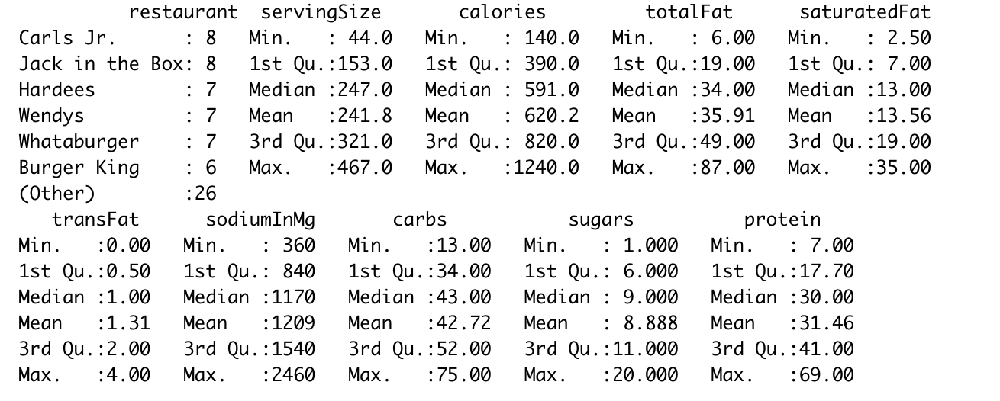

##Курсов проект по R - Анализ на данни

###### Гьокан Неждетов Сюлейманов ФН 62117, СИ 3-ти курс

### 1. Преглед на данните

Данните използвани в този проект са изтеглени от https://www.statcrunch.com/app/index.php?dataid=2323899

Това са хранителни данни за бургерите предлагани в различни вериги за бързо хранене в САЩ през 2017г. 

``````R
# Прочитаме данните от food_data.csv 
food_data = read.table("food_data.csv", header=TRUE, sep=";")

# Разгледаме първите няколко реда
head(food, n=15)
``````


Данните представляват подробен хранителен анализ на бургери в ралични ресторанти.

Колоните в таблицата са:

- restaurant -> *McDonalds, Burger King, Wendys, Jack in the Box, Sonic, Dairy Queen, Carls Jr., Hardees, White Castle, Whataburger,In-N-Out Burger*
- servingSize -> тегло на бургера в грамове
- calories -> калории на бургера
- totalFat -> общо мазнини в грамове
- saturatedFat -> наситените мазнини в грамове
- transFat -> транс мазнини в грамове
- sodiumInMg -> сол в милиграм
- carbs -> въглехидрати в грамове
- sugars -> захари в грамове
- protein -> белтъчини в грамове

Тъй като представените данни са в грамове би било по-полезно да трансофрмираме колоните totalFat,  carbs и  protein в % калории.

Прието е, че 1грам мазнини са 9 калории, 1 грам въглехидрати и белтъци са 4 калории.

За целта ще създадем идентичен нов data-frame който ще съдържа % съотношение между трите съставки.

``````R
fd <- food_data[,c(4, 8,10)] # Избираме съотвените номера на колони
fd$totalFat <- fd$totalFat * 9
fd$carbs <- fd$carbs * 4
fd$protein <- fd$protein * 4
percentage <- round(fd/rowSums(fd), 2) #   Процентното разпределение
``````

## 2. Анализ на данните

* Структура на променливите

  ``````R
  str(food_data)
  ``````


Тук имаме 1 категорийна променлива с 11 нива и 9 числови променливи

* **Обща статистика на данните**

  ``````R
  summary(food_data)
  ``````



​       Тук виждаме минимални, максимални, средна стойност и мода на различните променливи. Например: най-високо калоричния бургер е 1240 калории, средната стойност на транс-мазнините е 1.31 грама, Средно един бургер има 1200милиграма сол и 620 калории.

- ##### Процентно разпределение на ресторантите по броя на предлагани бургери

  ``````R
  t_restaurants <- table(food_data$restaurant)
  barplot(prop.table(t_restaurants)*100, 2, ylim=c(0,12)) 
  ``````


Както се вижда от хистограмата, различните ресторанти предлагат подобно разнобразие от бургери с изключение на *In-N-Out Burger*. Най-голямо разнобразие предлагат *Carls Jr*. и *Jack in the Box*.


* ##### Графично представяне на данните

  Визуално разпределение на бургери по калории:

  ``````Rh
  hist(food_data$calories)
  ``````


``````R
library(ggplot2)
ggplot(food_data,aes(x=food_data$calories, fill=food_data$restaurant)) + geom_histogram()
``````


Тук разпределението е доста смесено и не можем да направим някакви изводи освен, че *WhiteCastle* предлагат най-малко калорични бургери, а *Sonic* най-калорични.


Визуално разпределение спрямо транс-мазнини в бургерите:

``````R
ggplot(food_data,aes(x=food_data$transFat, fill=food_data$restaurant)) + geom_histogram()
``````


С най-високо съдържание на транс-мазнини са бургери, предлагани от *Wednys, Sonic, Carls Jr.* 

Отново тук не бихме могли да направим някакво заключение, защото дистрибуцията не е разпределна.  Можем да избягваме да се храним от *Wednys, Sonic, Carls Jr.* , които са първенци по транс-мазнини.


* Boxplot на данните - връзка между числова и категорийна променлива

  ``````R
  ggplot(food_data, aes(x=percentage$protein, y = food_data$calories, fill = food_data$restaurant)) + geom_boxplot()
  ``````

  

Най-богатите на % протеин бургери са предлагани от *Wednys, McDonalds, Dairy Queen* с над 20%.

Най-ниско калорични и богати на протеин бургери се предлагат от *Whataburger* 

Най-ниски на белтъци и високи на калории, са бургерите в *Hardees* 


* Корелация между променливи 

  ``````R
  ggplot(food_data,aes(food_data$calories, food_data$totalFat, colour = food_data$restaurant)) + geom_point()	
  ``````


Тук виждаме логична пряка корелация между грамове мазнини и калории. Спрямо типовете ресторанти не може да направим извод, защото нямаме струпване. Може би, защото повечето верига магазини предлагат голямо разнобразие от типове на бургери.

``````R
cor(food_data[,2:10])
``````


### 3. Заключение

Може да се заключи, че различните верига магазини предлагат бургери с подобен хранителен състав. Трудно можем да определим някоя от тях като най-здравословен или най-нездравословен. 